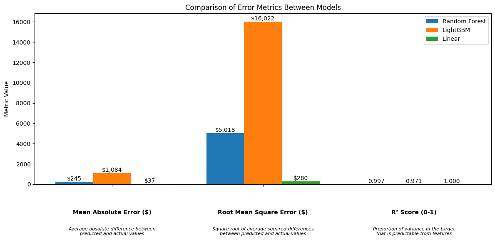

# Introduction

This is my Capstone project that attempts to answer the question "how can historical pharmacy claims data be used to accurately forecast a health plan group's drug spend over the next 12-24 months, accounting for utilization patterns, price changes, and member dynamics?". This is a Python data science project that uses historical pharmacy claims data to forecast drug spend. Answering this question will help health plan groups budget for future expenditures and assist in setting more accurate financial guarantees.

## Drug Spend Forecasting Model Analysis

**Business Problem:** Healthcare plans need accurate forecasts of future drug spend to set budgets, plan resources, and negotiate contracts effectively. The key business question this project attempts to answer is: "How can historical pharmacy claims data be used to accurately forecast a health plan group's drug spend over the next 12-24 months?" This has significant implications for:

- Financial planning and budgeting
- Setting accurate premium rates
- Contract negotiations with pharmaceutical providers
- Resource allocation
- Risk management

## Jupyter Notebook & Analysis

The Jupyter Notebook is the main file for this project. It contains the data cleaning, exploratory data analysis, feature engineering, modeling, and evaluation. It can be found here: [Jupyter Notebook](notebook.ipynb)

The analysis of sample values from each model is also available in the [ANALYTICS.txt](ANALYTICS.txt) file.

## Model Analysis

For this project, I built three models to forecast drug spend over the next 12-24 months. The models I used are:

- Random Forest Model
- LightGBM Model
- Linear Regression Model

### Random Forest Model

How it works:

A Random Forest model is like asking 100 smart friends to predict next month's drug spending - but instead of just one friend making a guess based on all the information, each friend looks at different pieces of data (like member counts, spending patterns, etc.) before making their prediction. All their guesses are then averaged together to make one final prediction. Just like how a group guess is usually better than one person's guess, this makes Random Forest typically more accurate than simpler prediction methods.

Performance:

- MAE: $244.78 (predictions are off by $244.78 on average)
- RMSE: $5,018.28 (predictions differ from the actual drug spend by about $5,018)
- R²: 0.997 (means the model explains 99% of the variability in drug spend)
- Mean Bias: $197.63 (indicates model consistently overpredicts by $197.63)
- Over-prediction rate: 77.8% (model predicts higher than actual 77.8% of the time)

Key Findings:

- Strongest overall performer for balanced accuracy
- Most important features are ingredient costs and acquisition costs
- Shows consistent performance across spend ranges
- Slight tendency to overpredict

### LightGBM Model

How it works:

LightGBM is like having a team of smart friends predict drug spending together, where each new prediction builds upon what was learned from previous predictions. Instead of everyone working independently like in Random Forest, each team member learns from the others' mistakes and focuses especially on the difficult cases that weren't predicted well before. This makes it both faster and often more accurate than simpler methods, particularly with large amounts of data.

Performance:

- MAE: $1,083.70 (predictions are off by $1,083.70 on average)
- RMSE: $16,021.53 (predictions differ from the actual drug spend by about $16,021.53)
- R²: 0.971 (means the model explains 97% of the variability in drug spend)
- Mean Bias: $540.01 (indicates model consistently overpredicts by $540.01)
- Over-prediction rate: 74.9% (model predicts higher than actual 74.9% of the time)

Key Findings:

- Higher variance in predictions compared to Random Forest
- More sensitive to member dynamics and utilization patterns
- Shows larger errors in high-spend scenarios
- Most complex feature relationships captured

### Linear Regression Model

How it works:

Linear regression is like drawing the simplest, most direct line through your historical drug spending data to predict future spending. It's similar to having a basic math formula where you plug in what you know (like member count, season, etc.) and get a prediction back. While it's not as sophisticated as other methods, its simplicity makes it easy to understand and explain - if X goes up by a certain amount, Y will go up by a proportional amount.

Performance:

- MAE: $37.14 (predictions are off by $37.14 on average)
- RMSE: $280.38 (predictions differ from the actual drug spend by about $280.38)
- R²: 1.000 (means the model explains 100% of the variability in drug spend)
- Mean Bias: $3.68 (indicates model consistently overpredicts by $3.68)
- Over-prediction rate: 62.1% (model predicts higher than actual 62.1% of the time)

Key Findings:

- Surprisingly strong performance, especially for low-spend scenarios
- Most interpretable model with clear feature coefficients
- Focuses heavily on member demographics
- Most stable predictions but may miss complex patterns

## Key Findings & Recommendations

### Model Selection

1. Primary Model: _Linear Regression_

    - Best overall performance metrics
    - Most interpretable for stakeholders
    - Lowest bias and prediction error
    - Most stable across spend ranges

2. Backup Model: _Random Forest_

    - Strong performance with more complex relationships
    - Better at capturing non-linear patterns
    - More robust to outliers
    - Useful for validation and comparison

### Feature Importance Insights

1. Cost Drivers

    - Approved ingredient cost is the strongest predictor
    - Acquisition cost provides significant signal
    - AWP cost is a reliable indicator

2. Utilization Patterns

    - Total claims and unique drugs are key predictors
    - Member utilization rates provide important signals
    - Days supply shows moderate importance

3. Member Demographics

    - Total eligible members is crucial for linear model
    - Gender distribution provides significant signal
    - Geographic distribution (zip codes) shows moderate importance

### Next Steps & Implementation Plan

#### Model Improvement

1. Technical Enhancements

    - Implement ensemble approach combining linear and random forest predictions
    - Add time series components for seasonal patterns
    - Develop automated feature selection pipeline
    - Implement online learning for continuous model updates

2. Feature Engineering

    - Create more granular temporal features
    - Add drug category-specific features
    - Develop member cohort features (e.g., group members by age, gender, utilization patterns, and chronic conditions to identify distinct population segments for targeted analysis)
    - Include market trend indicators

#### Business Implementation

1. Short-term Actions (0-3 months)

    - Deploy model in production environment
    - Create automated reporting dashboard
    - Train business users on interpretation
    - Establish monitoring framework

2. Medium-term Actions (3-6 months)

    - Integrate with financial planning systems
    - Develop what-if analysis tools
    - Create contract negotiation support tools
    - Implement automated alerts for significant deviations

3. Long-term Actions (6+ months)

    - Expand to drug category-specific models
    - Develop competitor benchmarking
    - Create market trend integration
    - Build automated model retraining pipeline

#### Risk Mitigation

1. Model Monitoring

    - Implement drift detection
    - Track prediction accuracy monthly
    - Monitor feature importance stability
    - Set up automated retraining triggers

2. Business Process Integration

    - Create clear escalation paths
    - Establish override protocols
    - Document assumption changes
    - Maintain version control of predictions

The implementation of these recommendations would create a robust forecasting system that provides accurate predictions while maintaining interpretability and adaptability to changing market conditions.

## Conclusion

This project has provided a comprehensive analysis of historical pharmacy claims data to forecast drug spend over the next 12-24 months. The findings and recommendations presented here offer a roadmap for implementing a forecasting system that addresses the business problem of accurately predicting drug spend.
